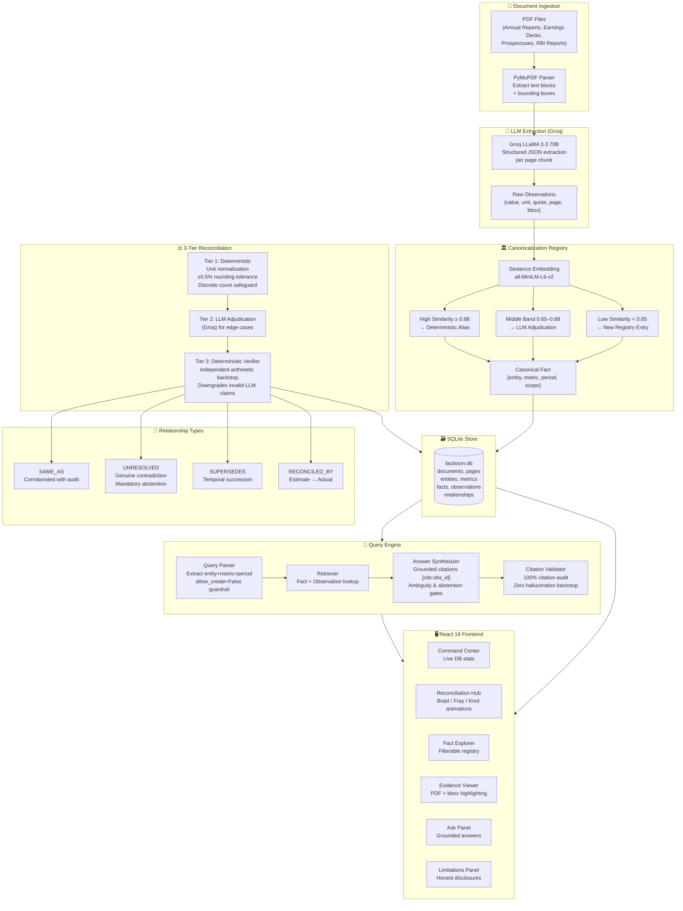
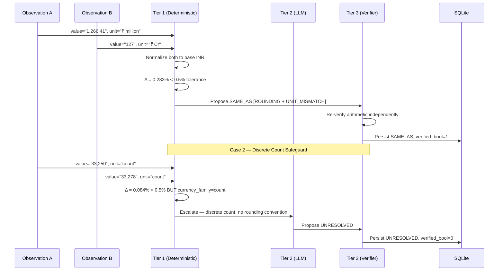

# FactLoom — Auditable Cross-Document Fact Reconciliation

> **"When documents disagree, don't average — audit."**

FactLoom is a full-stack system that reads multiple financial and regulatory PDFs, extracts every numerical claim with its exact source quote, and then deterministically decides whether two numbers are the *same fact* expressed differently, a genuine contradiction, or superseded by a later filing. Every answer is grounded in verifiable evidence with zero hallucinated citations.

[](eval/results.json)
[](tests/)
[]()
[]()

---

## Table of Contents

- [Problem & Solution](#problem--solution)
- [Architecture](#architecture)
- [The 3-Tier Reconciliation Pipeline](#the-3-tier-reconciliation-pipeline)
- [Unique Technical Features](#unique-technical-features)
- [Quick Start](#quick-start)
- [Running the Eval Suite](#running-the-eval-suite)
- [Demo Cases](#demo-cases)
- [Dataset & Documents](#dataset--documents)

---

## Problem & Solution

### The Problem

Financial documents routinely report the *same number* in different ways:

| Document | What it says |
|---|---|
| Annual Report | EBITDA: ₹1,266.41 million |
| Earnings Deck | Adjusted EBITDA: ₹127 Cr |

A naive system sees two different numbers and either ignores one, averages them, or — in the case of LLMs — invents an explanation. None of these are acceptable when the stakes are legal filings, audit trails, or investor due diligence.

### The Solution

FactLoom treats every number as a **Fact** with three mandatory properties:
1. **Who** — the entity (e.g., Delhivery Limited)
2. **What** — the canonical metric (e.g., Adjusted EBITDA)
3. **When** — the exact fiscal period (e.g., FY24)

Every claim extracted from a PDF is an **Observation** — a verbatim quote, page number, bounding box, and raw value. The system then runs a 3-tier pipeline to decide whether two Observations of the same Fact are corroborated, superseded, or genuinely unresolved — and it proves its work with arithmetic.

---

## Architecture



---

## The 3-Tier Reconciliation Pipeline



---

## Unique Technical Features

### 1. Discrete Count Safeguard
The system distinguishes continuous financial figures (where ±0.5% rounding tolerance applies) from discrete counts like headcounts. 33,250 vs 33,278 is only 0.084% — which *passes* the continuous tolerance but the engine **correctly abstains** because you cannot round a customer count.

### 2. Zero Query-Time Registry Pollution
A `allow_create=False` guardrail on the query parser prevents question strings (e.g., *"What is EBITDA across all documents?"*) from being inserted into the metric registry. Without this, past ghost metrics pollute future queries and return empty results silently.

### 3. Three-Tier Verification with Independent Backstop
Every relationship produced by LLM adjudication is independently re-verified with deterministic arithmetic. If the LLM claims two different numbers are `SAME_AS` but the math doesn't check out, the Tier-3 verifier **downgrades** it to `UNRESOLVED` and logs the rejection.

### 4. Temporal Supersession Tracking
When Suvir Sujan resigned as a director in August 2023, the 2022 Prospectus still listed him as "Nominee Director." The system correctly identifies the later filing supersedes the earlier one and answers *"Is he still a director?"* with `No` — citing both documents and explaining the succession.

### 5. Mandatory Abstention Gate
When a user asks a temporally unanchored question (e.g., "What is India's GDP growth?"), the system presents *all* matching facts from different fiscal periods side-by-side instead of collapsing them into a single number.

### 6. 100% Citation Resolution Rate
Every `[cite:obs_id]` badge in an answer is validated against the SQLite database before the response is returned. Zero hallucinated citations — any observation ID that doesn't resolve causes the citation validator to flag the answer.

---

## Quick Start

### Prerequisites
- Python 3.10+
- Node.js 18+
- A Groq API key (free tier works for demos)

### 1. Clone and configure

```bash
git clone https://github.com/darksinnnn/FactLoom.git
cd FactLoom
cp .env.example .env
# Edit .env and set: GROQ_API_KEY=your_key_here
```

### 2. Install backend dependencies

```bash
python -m venv .venv
.venv\Scripts\activate      # Windows
# source .venv/bin/activate  # Mac/Linux
pip install -r requirements.txt
```

### 3. Install frontend dependencies

```bash
cd frontend
npm install
cd ..
```

### 4. Start everything with one command

```bash
npm install          # From project root — installs concurrently
npm run dev          # Starts FastAPI backend (port 8000) + Vite frontend (port 5173)
```

Open [http://localhost:5173](http://localhost:5173)

### 5. Seed the demo cases

The database is pre-seeded. If you need to re-seed:

```bash
.venv\Scripts\python -m backend.query.seed_cases
```

---

## Running the Eval Suite

The full 28-question benchmark runs end-to-end against the live database:

```bash
.venv\Scripts\python eval/run_eval.py
```

Results are written to `eval/results.json` and stored in the `eval_runs` SQLite table.

**Phase 7 benchmark results:**

| Category | Pass Rate |
|---|---|
| Extraction & Unit Conversion | 4/4 — 100% |
| Temporal Governance | 4/4 — 100% |
| Reconciled Metrics | 4/4 — 100% |
| Mandatory Abstention | 4/4 — 100% |
| Ambiguous Inquiry Handling | 4/4 — 100% |
| Cross-Doc Generalization (Apple 10-K) | 4/4 — 100% |
| Hallucination Traps | 4/4 — 100% |
| **TOTAL** | **28/28 — 100%** |

---

## Demo Cases

| Case | Documents | Reconciliation | Outcome |
|---|---|---|---|
| **Case 1: EBITDA Corroboration** | Annual Report + Earnings Deck | ₹1,266.41M vs ₹127 Cr — Δ 0.283% | `SAME_AS` [ROUNDING + UNIT_MISMATCH] |
| **Case 2: Active Customers** | Annual Report + Earnings Deck | 33,250 vs 33,278 — Δ 0.084% | `UNRESOLVED` [Discrete Count Safeguard] |
| **Case 3a: Director Status** | Prospectus 2022 + BSE Filing 2023 | Nominee → Resigned Aug 24, 2023 | `SUPERSEDES` |
| **Case 3b: GDP Estimate vs Actual** | Economic Survey + RBI Report | 8.2% estimate vs 8.4% actual | `RECONCILED_BY [ESTIMATE_VS_ACTUAL]` |

---

## Dataset & Documents

The starter dataset includes real public domain filings:

| # | File | Type | Pages |
|---|---|---|---|
| 1 | `01-delhivery-prospectus-2022-excerpt.pdf` | IPO Prospectus | 50p excerpt |
| 2 | `02-delhivery-annual-report-fy24-excerpt.pdf` | Annual Report | 50p excerpt |
| 3 | `03-delhivery-q4-fy24-earnings-presentation.pdf` | Earnings Deck | 50p excerpt |
| 4 | `01-india-economic-survey-2024-25-excerpt.pdf` | Gov. Report | 50p excerpt |
| 5 | `02-rbi-annual-report-2024-25-excerpt.pdf` | Central Bank Report | 100p excerpt |
| 6 | `apple-10k-fy24.pdf` | SEC 10-K (out-of-corpus test) | Full |

---

## Tech Stack

| Layer | Technology |
|---|---|
| Backend API | FastAPI 0.115, Python 3.10 |
| LLM Inference | Groq (LLaMA 3.3 70B) |
| PDF Processing | PyMuPDF |
| Embeddings | sentence-transformers (all-MiniLM-L6-v2) |
| Database | SQLite (factloom.db) |
| Frontend | React 19, TypeScript, Vite 8 |
| Styling | Tailwind CSS v4 |
| 3D Visuals | Three.js + React Three Fiber |
| Animations | Framer Motion + GSAP + Lenis |
| UI Icons | Phosphor Icons |

---

*FactLoom v0.1.0 — Built with grounded truth as a first principle.*
